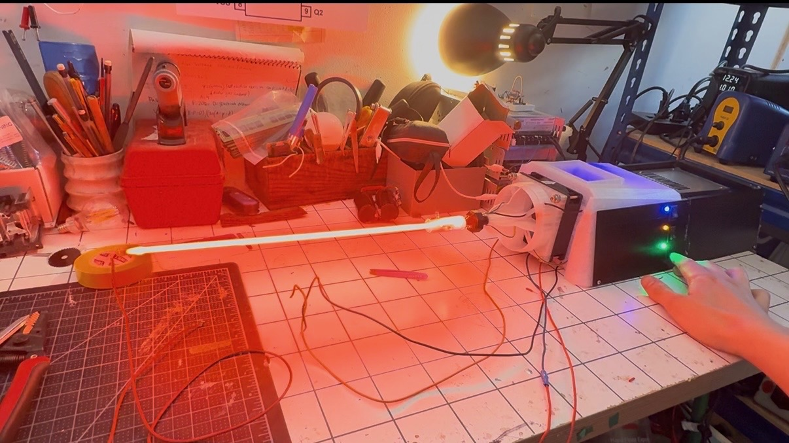
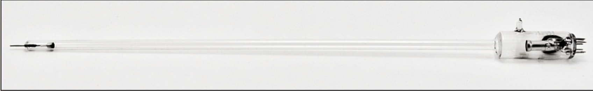
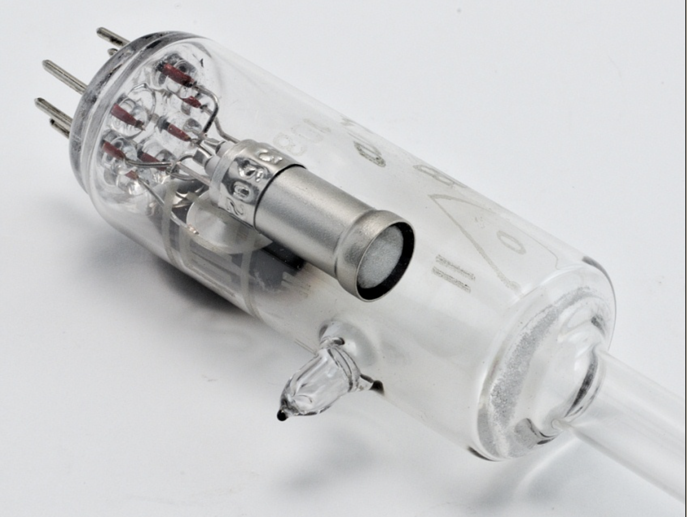
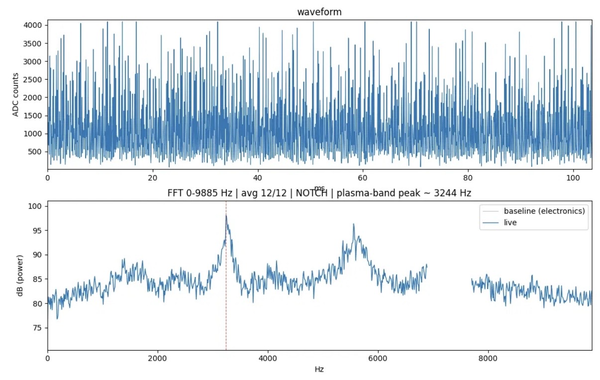
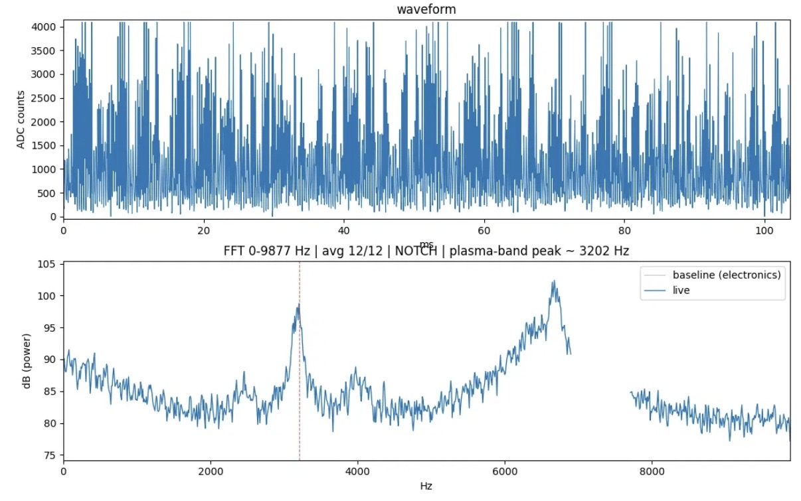
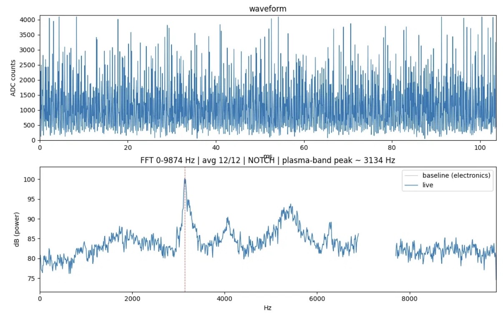
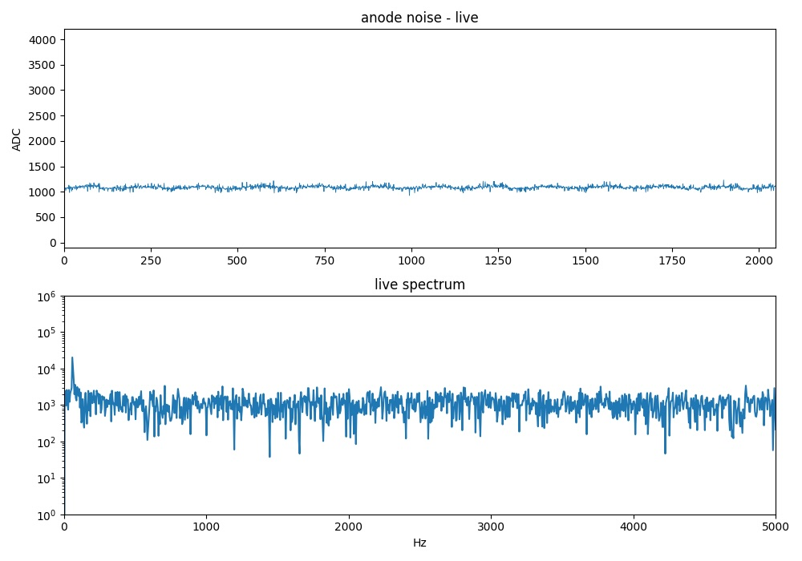
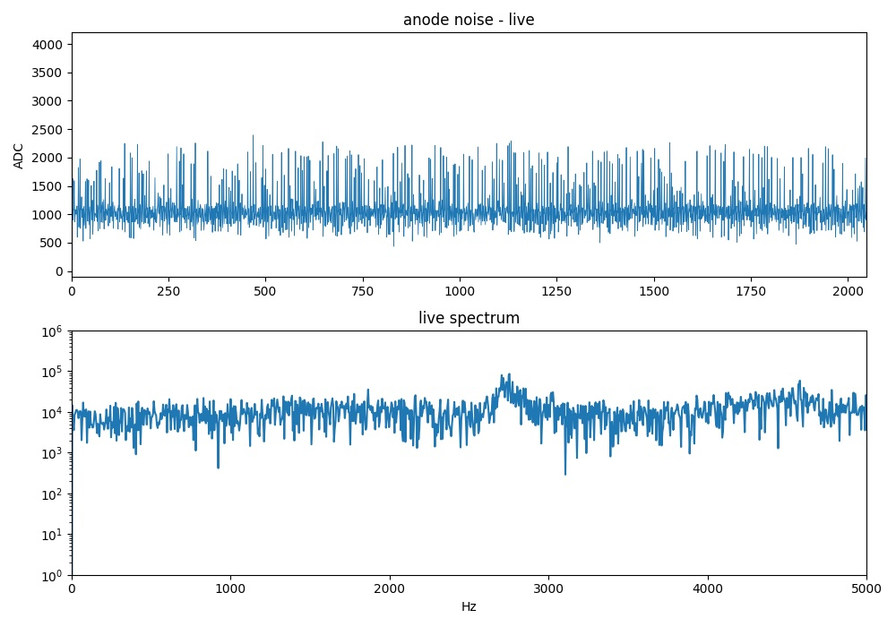
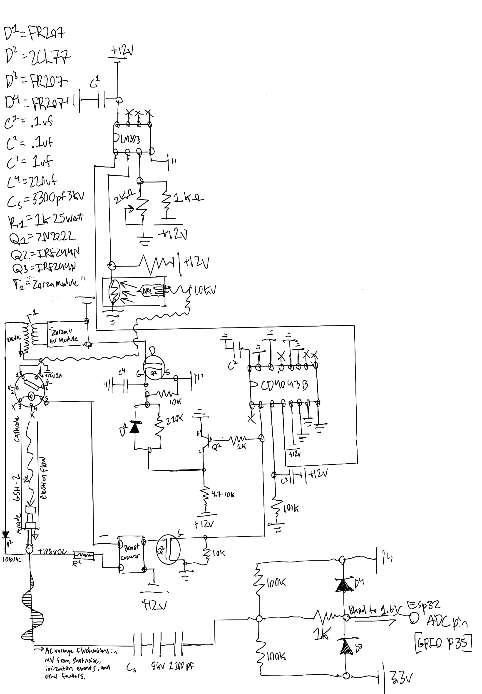

# Neon-Plasma-Tube-Entropy-Source- [Still Under Development]
Using the Ghs-2 Soviet noise tube I created a scientific instrument in order to study ionization in neon. 
This instrument doubles as a random number generator, AC voltage fluctuations are decoupled from the anode side of the tube, biased, then fed into ADC pin of an ESP32. The mV voltage fluctuations are caused by a combination of shot noise, ionization events, and other factors. More on that below. 

# The GSH-2 

The GSH-2 is a 1970s broadband noise tube manufactured in the USSR, these were predominantly used for military purposes, namely random number generation. 
The glass envelope , is 14 inches long , 5mm diameter at the thinnest point.  
This tube is optimized for 7 - 10Ghz signals, and was used mostly in radar and microwave equipqment. 
In this project I sampled only the low-end of the spectrum, 0-10khz, making this a relativily doable task for any hobbiest, without RF equipment. 

There are 7 pins, making it a typical octogonal vacuum-tube style base. Pin 7 is NC. 
From looking at the gap, moving clockwise from the left pin of the gap to right, count 1-7.

Pins 3-5 are connected internally at a near short (.5 ohms)
Pins 1-6 are also connected interally at a near short (.5 ohms) 
pin 7 is NC 
Pins 2 and 4 are connected to the sleave of the filament. 

# How the GSH-2 works
Pins 1-6 (filament) is heated at 12V 1.08A (DC) and turns red hot, the filament is covered in an oxide layer which when heated boils off electrons via thermionic emission.
Simultaneous to this, 10Kvac 200-500Khz (RF) strike voltage is supplied to the tube for a brief moment, the ionizing neon triggers the logic circuit (more on below) which turns off the strike voltage, and turns on a sustaining voltage of 150-200Vdc. Once the ionization is sustained, there will be a negative dark space observable , there will be an ionization cloud surrounding the cathode side of the tube. 
Whith the filament boiling off electrons , and +150-200Vdc supplied to the anode , electrons from the filament (thermionic emission) with fly through the dark-space of the tube , causing voltage fluctuations on the anode, these mVAC fluctuations are decoupled, biased, and fed into the ADC GPIO P35 of an ESP32. 

# Quick Note About This Current Iteration 

Despite what's stated above, which is how I believe the tube is supposed to function, my instrument doesn't function like that/as intended (yet). When I was pondering this project, and got the tube in the mail, I started working on mental/conceptual work, thinking about ways to extract the voltage fluctuations from this tube and how it was made to function. I beleive I was correct, in that the anode is where the fluctuations are measured, I imagined the electron avalanche being initiated by the strike voltage and shotnoise, electrons flying through the dark space towards the anode and positive 200 volt field, ionizing the neon en route. (As seen in the first picture when the tube was being ionized by 10kv-20kv RF). Unfortunately after I built this I only got a cathode glow, a slight ionization cloud surrounding the cathode. (See below). 

My build wasn't living upto my mental models of how the physics and circut was supposed to behave. To my pleasure however, I was in fact reading voltage fluctuations in the mV, decoupled from the anode*. My immediate thought was skepticism, this could be random electronic noise I'm reading instead of fluctuations caused by ionization events and shot-noise. With the ADC baseline at 1060 refer to 'ADC_Data_Tube_Off' and compare to 'ADC_Data_Tube_On' to compare the fluctuations. Below take note of the ADC waveform and fourier transform graphed. Initially I was only sampling from 0-5hz, take note of a small peak around 3khz-4khz. I was worried it was electrical noise (from the DC switching boost converter) however I observed the peak decrease in frequency as the tube ran, around 100-500hz. I hypothesize this is due to the increasing tempurature of the tube, changing the frequency of a relaxation oscillation. I ran the tube for extended periods from a cold start, and each time observed the same effect - the peak starting around 3600hz would shift to a lower hz. I then started to sample higher frequencies up to 10khz. I observed more peaks, one around 7khz which I did identify as electrical noise. Via python I subtracted this peak , (listening to the advice of my friends on the R/Physics sub-reddit...). Notice however the 3khz-4khz plasma peak remains, shifting slighly in hz. (see below). 

# Cathode
For this project I used a PSU from a Dell PC I salvaged, 12V with the capability to supply 16A. However any supply meeting 12V, at least able to supply 6A would suffice. 

The most complex part of this project was the logic level circuitry.

I had to figure out a way to send a signal that the tube was sucessfuly ionized, in order to shut off the strike voltage, and in turn activate the sustained DC lower voltage. The challenge was isolating the HV from the low voltage logic circutiry while still sending an accurate and timely signal. After much thought, I decided to create a custom high voltage octocoupler, settling for a Ne-2 neon bulb enclosed in a darkspace with an LDR. When the tube is successfully ionzied, the Ne-2 bulb is instantaneously ionized as well, flooding light into the dark enclosure, and allowing current through the photoresistor. This causes the comparater output to go high , which also causes the CD4043B output to go high as well. The outputting signal leads to Mosfet 1 which allows current to flow to ground from the DC boost converter, sustaining the ionization of the tube. The outputting signal from the SR latch (CD4043B) also turns off the 10kvac strike voltage via inverted signal. 
# Anode 

# Mistakes I made 
I made many mistakes while working on this project, especially considering this current iteration was completed in 25 days exactly. I built this for OpenSauce 2026, and as of today [7.12.26]. I'll be exhibiting this project in 3 days. 

The largest mistake I made, is unfortunetly one I'm still looking to solve, one night after leaving the tube running for an extended period, a plethora of magic smoke emerged from the cathode side of my instrument..... I panicked, to put it lightly. I soon discovered, after some investigation, the 'Zorza module' completetly cooked itself, and turned into a resistor essnetially, electrons in the secondary being pulled forth by the positive DC voltage being applied at the Anode node. I forgot to add a diode.....

After adding the 10kv rated diode to the flyback rail, the tube wouldn't strike. I haven't figured out why, so for now I'm running the GSH-2 instrument in short periods of time to avoid barbequing another flyback secondary. 

During the conceptual work of this project, I envisioned a positive ionized column, on the anode side. (As demonstrated by the first picture) The entirety of the tube ionized.  instead in 25 days I only was able to get a cathode glow, a ionization cloud surrounding the cathode. I believe this is due to inadequet current being supplied, after measuring the DC supply, I was measuring 30mA which is extremely underdriven. I unfortunately haven't had time to work on this, in further iterations I hope to extend the positive column and get full ionization. The unfortunate reality is I'm not sure how this tube is supposed to be driven, as there is sparse to no information online about the GSH-2.

