# Neon-Plasma-Tube-Entropy-Source- [V.1]
Using the Ghs-2 Soviet noise tube I created a scientific instrument in order to study ionization in neon. 
This instrument doubles as a random number generator, AC voltage fluctuations are decoupled from the anode side of the tube, biased, then fed into ADC pin of an ESP32. The mV voltage fluctuations are caused by a combination of shot noise, ionization events, and other factors. More on that below. 

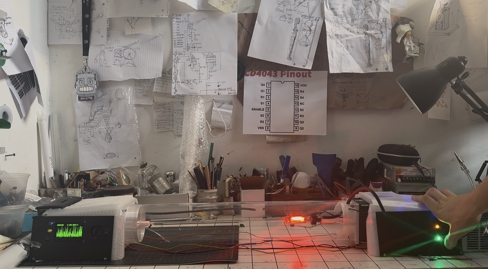

# Current Status 

- The instrument currently produces entropy from shot-noise, ionization events, and other factors. Post whitening, the ADC data was able to achieve 7.9 on ENT testing.
  
- Can be used to study neon-plasma behaviors.

- Gsh-2 tube filament successfully undergoes thermionic emission, and the tube sustains at 195vDC post 10kv strike.

- Due to errors in my circuit design topology the 195vdc/positive field, instead of being present on the intended electrode (on the opposite end of the tube) is instead coupling through the 10kv strike rail.

- This mis-aligned positive voltage field is causing the electrons boiled off of the filament (1-6) via thermionic emission, and electrons from ionization events to travel up the strike rail to the anode node, decoupling through the three capacitors in series into the esp32 ADC pin.

- This is seemingly fine as an entropy source but causing the ionization cloud to remain on the cathode side, instead of extending throughout the tube. 
  
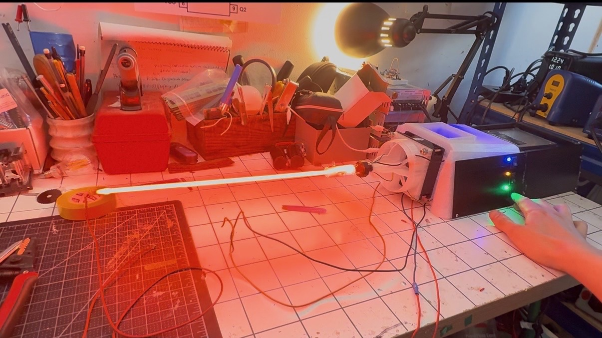

# The GSH-2 

The GSH-2 is a 1970s broadband noise tube manufactured in the USSR, these were predominantly used for military purposes, namely random number generation. 
The glass envelope , is 14 inches long , 5mm diameter at the thinnest point.  
This tube is optimized for 7 - 10Ghz signals, and was used mostly in radar and microwave equipqment. 
In this project I sampled only the low-end of the spectrum, 0-10khz, making this a relativily doable task for any hobbiest, without RF equipment. 

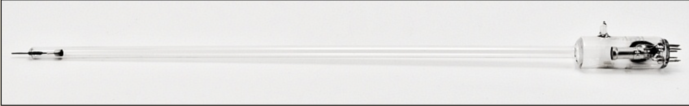

There are 7 pins, making it a typical octogonal vacuum-tube style base. Pin 7 is NC. 
From looking at the gap, moving clockwise from the left pin of the gap to right, count 1-7.

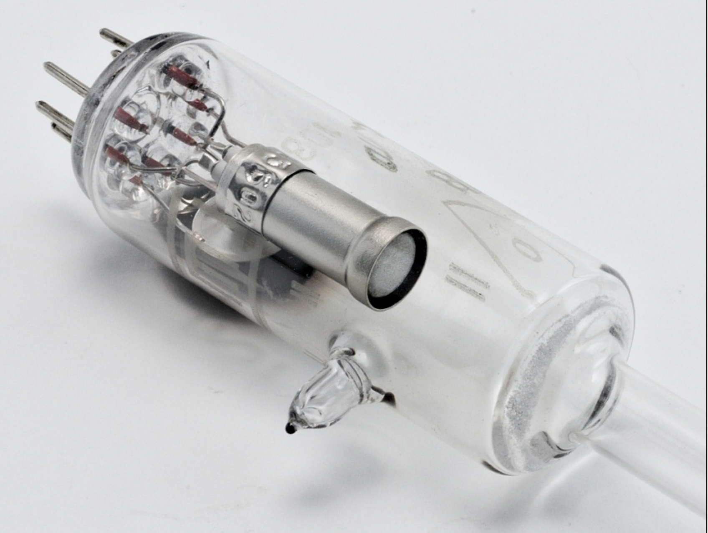

Pins 3-5 are connected internally at a near short (.5 ohms)
Pins 1-6 are also connected interally at a near short (.5 ohms) (filament with oxide coating - thermionic emission)
pin 7 is NC 
Pins 2 and 4 are connected to the sleave of the filament. 

Pin 1,6 - 12Vdc @ 1A (Filament)
Pin 2,4 - NC
Pin 3 - 0V , 195vdc boost converter 
Pin 5 - NC
Pin 7 - 10KvAc strike rail , and Ne+LDR custom HV octocoupler 

# How the GSH-2 works
Pins 1-6 (filament) is heated at 12V 1.08A (DC) and turns red hot, the filament is covered in an oxide layer which when heated boils off electrons via thermionic emission.
Simultaneous to this, 10Kvac 200-500Khz (RF) strike voltage is supplied to the tube for a brief moment, the ionizing neon triggers the logic circuit (more on below) which turns off the strike voltage, and turns on a sustaining voltage of 150-200Vdc. Once the ionization is sustained, there will be a negative dark space observable , there will be an ionization cloud surrounding the cathode side of the tube. 
Whith the filament boiling off electrons , and +150-200Vdc supplied to the anode , electrons from the filament (thermionic emission) with fly through the dark-space of the tube , causing voltage fluctuations on the anode, these mVAC fluctuations are decoupled, biased, and fed into the ADC GPIO P35 of an ESP32. 

# Quick Note About This Current Iteration 

Despite what's stated above, which is how I believe the tube is supposed to function, my instrument doesn't function like that/as intended (yet). When I was pondering this project, and got the tube in the mail, I started working on mental/conceptual work, thinking about ways to extract the voltage fluctuations from this tube and how it was made to function. I beleive I was correct, in that the anode is where the fluctuations are measured, I imagined the electron avalanche being initiated by the strike voltage and shotnoise, electrons flying through the dark space towards the anode and positive 200 volt field, ionizing the neon en route. (As seen in the first picture when the tube was being ionized by 10kv-20kv RF). Unfortunately after I built this I only got a cathode glow, a slight ionization cloud surrounding the cathode. (See below). 

My build wasn't living upto my mental models of how the physics and circut was supposed to behave. To my pleasure however, I was in fact reading voltage fluctuations in the mV, decoupled from the anode*. My immediate thought was skepticism, this could be random electronic noise I'm reading instead of fluctuations caused by ionization events and shot-noise. With the ADC baseline at 1060 refer to 'ADC_Data_Tube_Off' and compare to 'ADC_Data_Tube_On' to compare the fluctuations. Below take note of the ADC waveform and fourier transform graphed. Initially I was only sampling from 0-5hz, take note of a small peak around 3khz-4khz. I was worried it was electrical noise (from the DC switching boost converter) however I observed the peak decrease in frequency as the tube ran, around 100-500hz. I hypothesize this is due to the increasing tempurature of the tube, changing the frequency of a relaxation oscillation. I ran the tube for extended periods from a cold start, and each time observed the same effect - the peak starting around 3600hz would shift to a lower hz. I then started to sample higher frequencies up to 10khz. I observed more peaks, one around 7khz which I did identify as electrical noise. Via python I subtracted this peak , (listening to the advice of my friends on the R/Physics sub-reddit...). Notice however the 3khz-4khz plasma peak remains, shifting slighly in hz. (see below). 

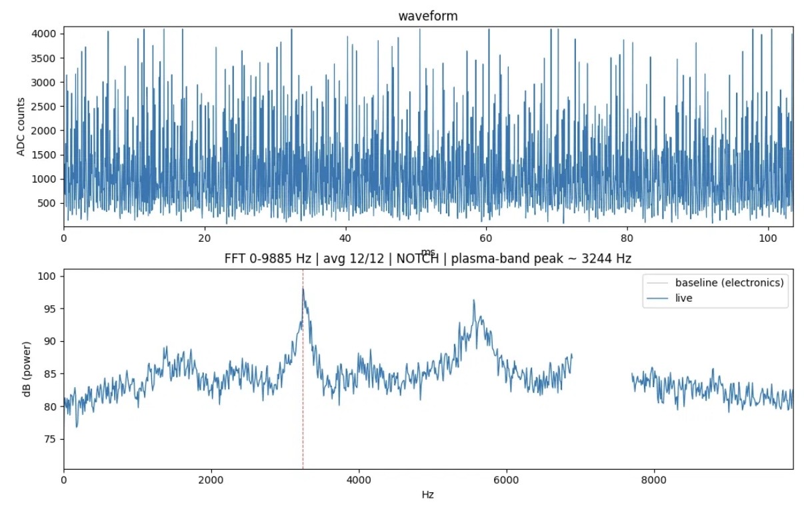
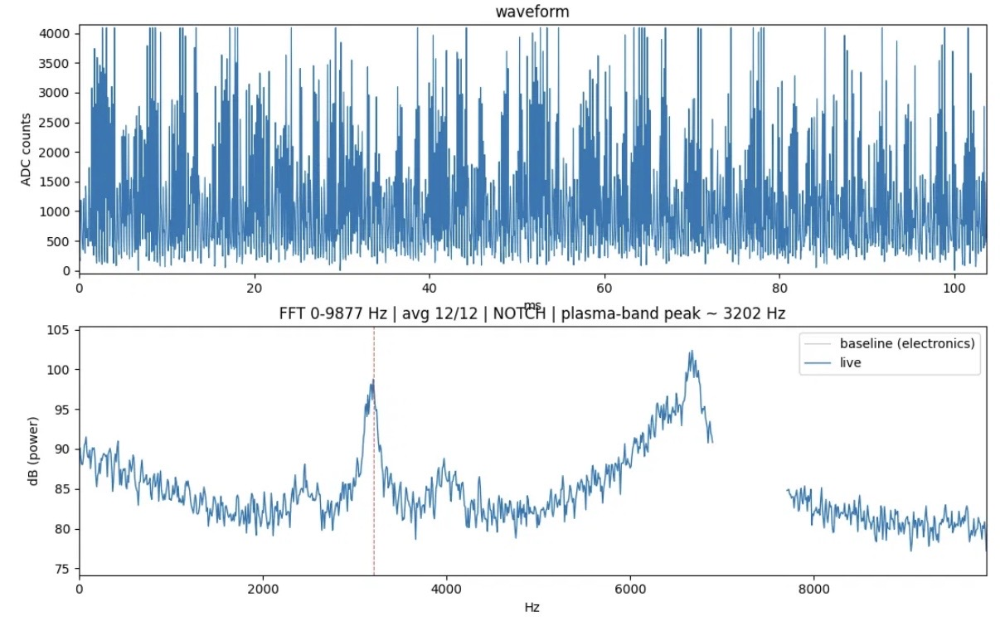

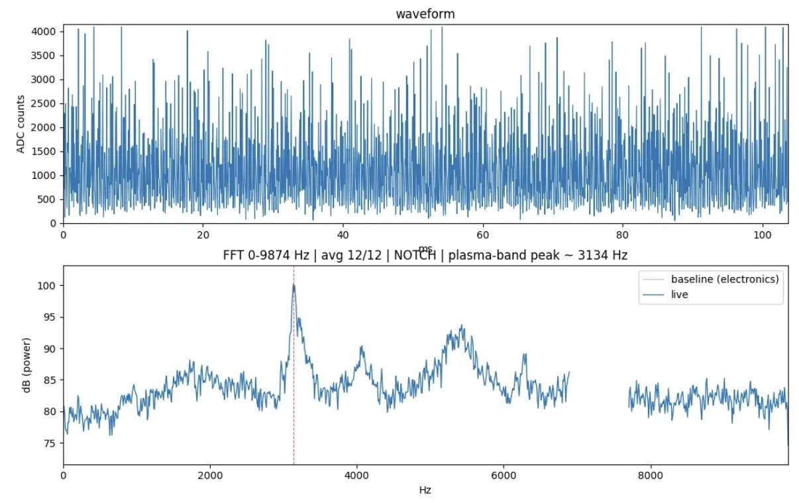

Sampling at 5khz, tube off vs on 

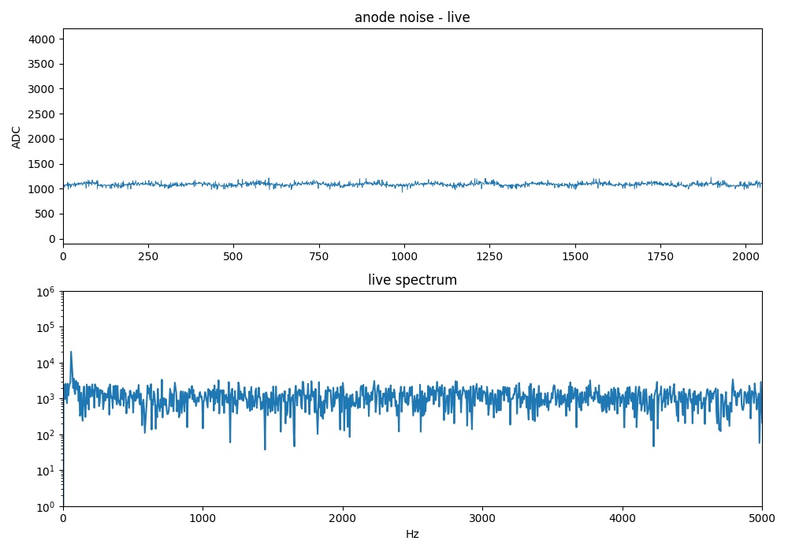
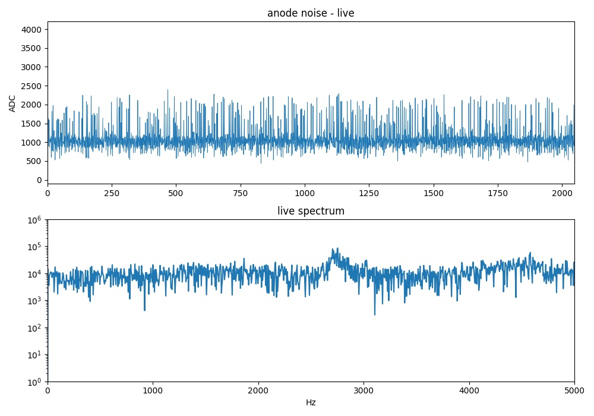

# Cathode
For this project I used a PSU from a Dell PC I salvaged, 12V with the capability to supply 16A. However any supply meeting 12V, at least able to supply 6A would suffice. 

The most complex part of this project was the logic level circuitry.
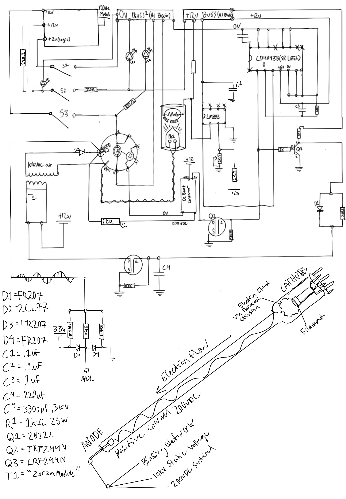
I had to figure out a way to send a signal that the tube was successfully ionized, in order to shut off the strike voltage, and in turn activate the sustained DC lower voltage. The challenge was isolating the HV from the low voltage logic circuitry while still sending an accurate and timely signal. After much thought, I decided to create a custom high voltage optocoupler, settling for a Ne-2 neon bulb enclosed in a dark space with an LDR. When the tube is successfully ionized, the Ne-2 bulb is instantaneously ionized as well, flooding light into the dark enclosure, and allowing current through the photoresistor. This causes the comparator output to go high, which also causes the CD4043B output to go high as well. The outputting signal leads to Mosfet 1 which allows current to flow to ground from the DC boost converter, sustaining the ionization of the tube. The outputting signal from the SR latch (CD4043B) also turns off the 10kvac strike voltage via inverted signal. 

# Anode 
While the most complex parts of this project are predominantly on the cathode side, the anode side is of no less importance. The current throughout the tube fluctuates, these fluctuations are decoupled through three capacitors in series, each one rated for 3kv at 33pF. These capacitors are necessary to decouple the current into a fluctuating voltage. Current can't pass through capacitors in series, so what is left is a sine wave of fluctuating charges, or potential differences - almost ready to be sampled through the ADC (analogue to digital conversion) pin of an ESP32. Prior to sampling however, I had to bias this sine wave of fluctuating charges originating from the ionization events and shot noise. Microcontroller pins can be damaged by negative voltage, so I had to figure out what voltage to bias the signal at. I decided to go as relatively low as possible and bias it at 1 volt in order to see the most miniscule of fluctuations. Later on, I added a potentiometer to the biasing network to add variability.

In addition to the biasing network I also added an OLED, with live diagnostics and Fourier Transforms. I originally sampled at 5khz then moved up to 10khz. The live transforms allow me to see the noise spectrum in real time, allowing me to detect any EMI, either native to the system or permeating my system from nearby electronics - more on that below in the next section. 

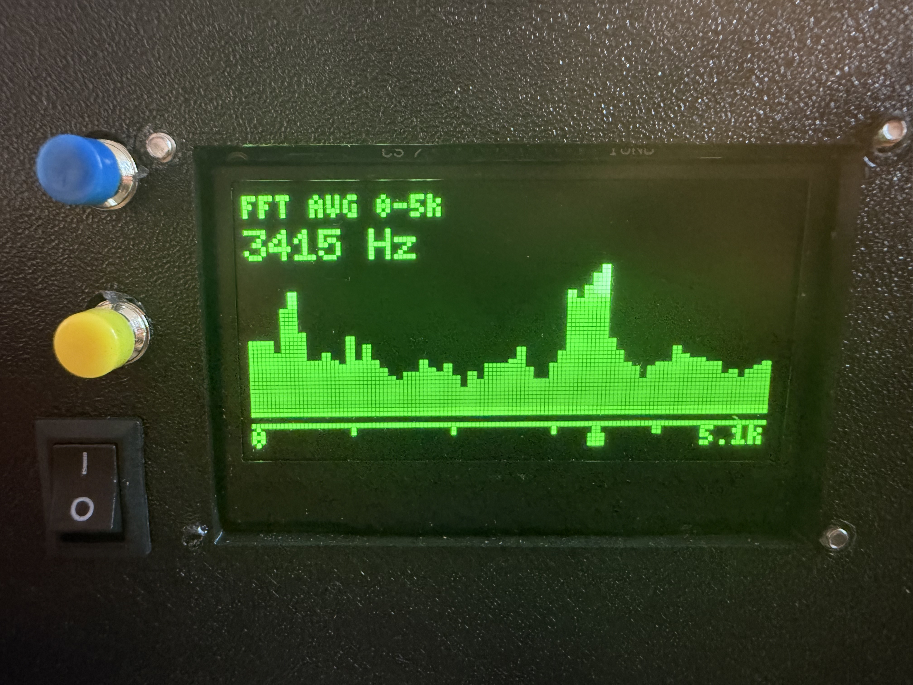

As previously stated, this instrument was made in 25 days for OpenSauce 2026, and I wanted to include an interactive component, so I added a thermal printer, and speaker. The speaker when turned on plays direct ADC wave form coming from the tube. The thermal printer prints out random numbers, and a dice roll for viewers to take home. I didn't include these in the schematic above however these applications are still included in the code. 

# Enclosure, EMI, and Thermal Managment

The largest challenge was shielding this instrument from EMI - I drove myself slightly insane! I mean, photons are everywhere how do I keep them out of my enclosure? Well, I didn't. For Plasma Entropy Source [V.2] however this is my primary goal - complete EMI shielding. 
For this project, I used 8-gauge coaxial line I found in my mom's closet. I wired the insulation of the cord to ground. I also put the entirety of the anode in a faraday cage and grounded that as well. Despite this meager effort at EMI deterring, I didn't get anywhere - primarily due to the ultimatum I had with OpenSauce.
I knew I wasn't keeping runaway electro-magnetism out after turning on the live Fourier transform, turning on my tesla coil, and watching the noise spectrum skyrocket.

I bought a 3D printer in order to complete this project in a semi-professional manner. I also had to teach myself cad (fusion-360) in order to complete this project, this took far more time than the circuitry. 

With an infrared thermometer I measured the cathode at 200 degrees F, to no surprise as this is a hot cathode tube which had 1 amp current running through it. I decided to add multiple fans and a cooling system to vent the hot air from the tube, this ended up working surprisingly well. As seen in the diagram, I have a fan on the anode side of the instrument which projects cool air through the glass tube along the GSH-2. This hot air is then vented through the top of the cathode side, through another fan spinning in reverse.

# Mistakes I made 
I made many mistakes while working on this project, especially considering this current iteration was completed in 25 days exactly. I built this for OpenSauce 2026, and as of today [7.12.26]. I'll be exhibiting this project in 3 days. 
______________________________________________________________________________________________________________________________________________________________
During the conceptual work of this project, I envisioned a positive ionized column, on the anode side. (As demonstrated by the first picture) The entirety of the tube ionized.  instead in 25 days I only was able to get a cathode glow, an ionization cloud surrounding the cathode. I believe this is due to inadequate current being supplied, after measuring the DC supply, I was measuring 30mA which is extremely underdriven. I unfortunately haven't had time to work on this; in further iterations I hope to extend the positive column and get full ionization. The unfortunate reality is I'm not sure how this tube is supposed to be driven, as there is sparse to no information online about the GSH-2. [7.10.26]

After adding the 10kv rated diode to the flyback rail, the tube wouldn't strike. I haven't figured out why, so for now I'm running the GSH-2 instrument in short periods of time to avoid barbequing another flyback secondary. [7.11.26]

The largest mistake I made, is unfortunately one I'm still looking to solve, one night after leaving the tube running for an extended period, a plethora of magic smoke emerged from the cathode side of my instrument..... I panicked, to put it lightly. I soon discovered, after some investigation, the 'Zorza module' completely cooked itself, and turned into a resistor essentially, electrons in the secondary being pulled forth by the positive DC voltage being applied at the Anode node. I forgot to add a diode..... [7.13.26]

This is also the reason I wasn't getting a positive ionization column; I eventually discovered a major error in my circuit topology. On the Anode side there is a node where the 10kv line, 200VDC, and decoupling caps intersect. I discovered the 200VDC current was coupling through the 10kv line, through the flyback secondary, and causing ionization on the cathode side, preventing the full positive ionized column and also causing the HV module to turn into a resistor! All of this seems so obvious in hindsight, current takes the path of least resistance! Of course, 14 inches of low-pressure neon gas will have higher resistance then roughly 14 inches of copper wire, and with all of them meeting at a singular node, the 200VDC will always pass through the wire as oppose to the higher resistance gas. I discovered this error after adding the diode, and wondering why after adding it, the tube would strike but not sustain, I realized the diode was blocking the 200vdc from passing through the strike line. Mystery solved. [7.14.26]

